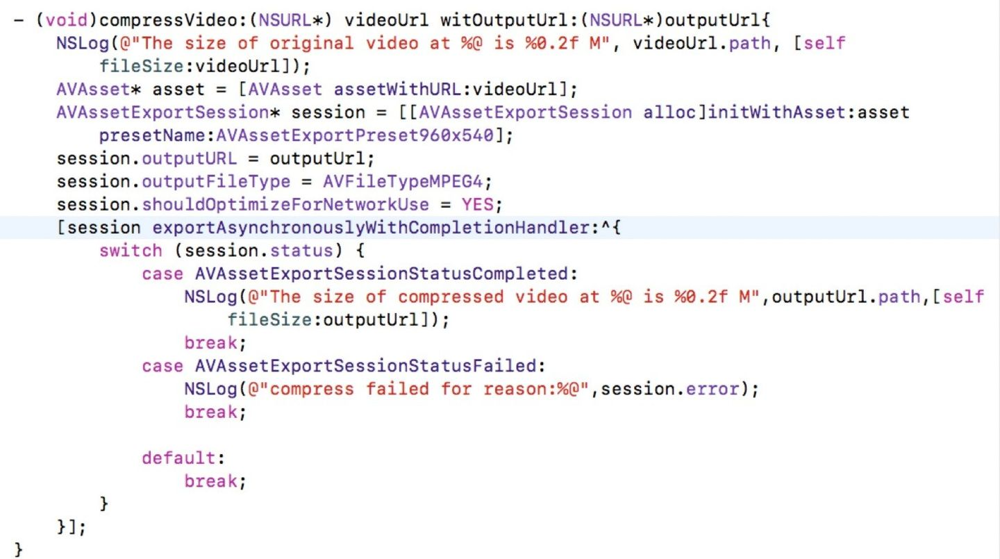
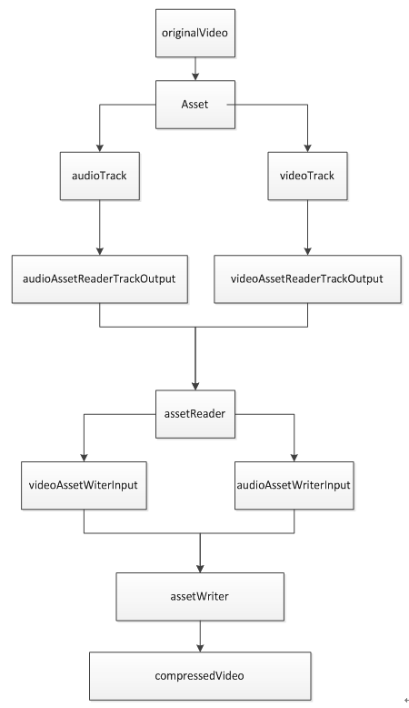

# iOS视频压缩


## 一、视频压缩基础
在介绍iOS端视频压缩之前，先了解一下影响一个视频体积大小的关键名词:

**码率(bit rate)**:也叫比特率，指数据传输时单位时间传送的数据位数，单位是bps(bit per second)。 bps在互联网中很常见,如ADSL带宽常用Mbps(兆位每秒),视频码率习惯用kbps (千位每秒)。它能直观的衡量一个视频的质量。按照其意义，码率最简单的计算公式为:视频文件大小/视频时长。一个视频的码率受视频的**编码算法、分辨率、帧率**等因素影响。视频文件体积与码率是成正比的，几乎所有的编码算法重视的都是如何用最低的码率达到最少的失真，围绕这个核心衍生出了cbr压缩（固定码率压缩）与vbr（可变码率压缩）。

**分辨率**:习惯上我们说的分辨率是指图像的高/宽像素值，严格意义上的分辨率是指单位物理长度内的有效像素值ppi(每英寸像素pixel per inch)。 差别是，图像的高/宽像素值和物理尺寸无关，但单位长度内的有效像素值ppi和物理尺寸有关。像素尺寸和物理尺寸，可以参考UIImage的宽高以及UIImageView的宽高。

**帧率**:指每秒钟有多张画面，单位简称FPS。视频实际是由一组连续的图片组成的，由于人眼有视觉暂留现象，画面帧率高于16的时候大脑就会把图片连贯成动画，高于24大脑就认为是非常流畅了。所以24FPS是视频行业的标准。

**视频编解码**：视频编码是指通过特定的算法，去除视频中的冗余信息(去除数据之间的相关性，帧内的叫空间冗余，帧间的叫时间冗余),因此编码技术包含帧内图像数据压缩编码技术、帧间图像数据压缩编码技术。视频解码是指能通过编码后剩余的信息，最大程度的还原出未压缩前的画面。目前最常用的编码压缩方式就是H264。不同的编码器，需要对应的解码器进行解码后才能渲染。视频视频技术比较复杂，这里不展开讨论。


**通过以上概念，我们可以得出一个结论：在选定一个合适的视频编码算法后，如果要尽可能的降低一个视频压缩后的体积，可以通过码率压缩、帧率压缩、分辨率压缩三处着手。需要注意的是，分辨率或者帧率压缩，并不是严格意义上的压缩，而是直接将原始数据进行删除裁剪，比如60帧的视频改成30帧，是直接丢失一半的原始图像，分辨率同理，裁剪的是一部分像素点。而码率压缩是针对编码算法而言的，编码后的数据还有一个解码的逆向还原过程。因此编码压缩一般都是限定编码算法的输出码率，让编码算法进行最大程度的数据压缩，至于最终解码后的还原度有多少，有损还是无损，则由算法本身所决定。合理选定压缩算法，限定其码率，裁剪其帧率或分辨率，是我们整个压缩的主要思路。**

<br>

**此外还值得一提的时候，码率是受帧率和分辨率影像的，码率压缩、分辨率裁剪、帧率裁剪三者之间有一个平衡极限，不能随意设置。举个例子：一个120FPS、4K(4096×2160)分辨率的视频，要求压缩后分辨率帧率不变，但输出一个低码率视频，这显然是不切实际的。码率低意味着压缩后保存的数据信息少，解码后能还原的数据自然就越不准确。所以找到三者之间的平衡关系，也是我们压缩实现过程中需要考虑的一点。**

<br>
<br>


## 二、视频压缩实现
iOS端的视频编解码实现方案主要有以下三个:
* **AVFoundation**:硬编码，常用于视频文件编码。
* **VideoToolBox**:硬解码，常用于视频直播流编解码。
* **FFmpeg**:跨平台的软编码方案。

鉴于我们项目的特点，我们选用的是AVFoundation框架。该框架下提供了两种压缩策略，可以记为传统压缩和自定义压缩，两种压缩策略实现如下：

#### **传统压缩实现:**


传统压缩涉及到的核心类是AVAssetExportSession，该类提供了一组针对AVAsset的视频导出api，使用十分方便，只需要配置好输出路径、输出视频格式以及编码配置即可。但该方案存在以下不足:编码配置只支持配置编码质量或限定分辨率。视频质量只有low、middle、high三个档位，分辨率参数只有几个常用分辨率。我们无法选择编码格式，也无法限定码率。对于压缩结果要求较低的App可以使用这种方式，如Signal使用的就是这种方式。

<br>

#### **自定义压缩实现:**
AVFoundation还提供了另一组框架，用于自定义视频的读写及编解码，涉及到的核心类主要有**AVAssetReader、AVAssetWriter、AVAssetReaderOutPut、AVAssetWriterInput、AVVideoComposition**等。这里简单讲解一下每个类的用途，方便大家理解。

* **AVAssetReader**: 资源读取器，调用系统底层解码器对资源进行读取并解码成可渲染的位图。一个视频资源对应一个Reader。
* **AVAssetReaderOutput**: 资源读取器输出，一个视频一般包含多个轨道，如视频轨道，音频轨道，因此一个Reader需要搭配多个Output来处理接收这些流数据，并将他们打包成CMSampleBuffer返回给Writer。

<br>

* **AVAssetWriter**: 资源写入器，将解码后的样本数据CMSampleBuffer按照指定编码配置重新编码并写入到指定路径下。
* **AVAssetWriterInput**: 资源写入器输入，因为有多个ReaderOutput会返回多个数据流，所以一个Writer需要搭配多个WriterInput处理这些流媒体的写入。

<br>

* **AVVideoComposition**: 用于拦截并处理解码后的视频流，合成新的视频流。如果我们希望读取到视频流后，改变其旋转方向，添加音乐、水印、滤镜等，就需要通过此类及其派生类进行帧处理。

我们项目中不需要处理解码后的视频帧，所以视频编码压缩的逻辑流程图简化如下:



wechat、whatsapp都是用的是自定义压缩方案，该方案可以在编码时自定义AVAssetWriter的编码格式:如选用H264编码算法，设置算法的编码精度并限定其最大输出码率，同时还可以限定其分辨率、帧率、旋转方向等。通过此方式进行的压缩效果，会比传统压缩扩展性更强，效果更好。yallachat目前也抛弃了传统压缩，所有视频资源都是使用自定义压缩方案实现。


需要注意的是：
* **不论是传统压缩还是自定义压缩，最底层调用的都是苹果提供的硬编码器，是写好在GPU上的固定程序。苹果允许存在不高于三个编码器同时工作，如果超过上限，则会报“编码器正在工作，导出失败”错误。**
* **自定义压缩虽然可配置度较高，但是有很多特殊情况需要处理，比如视频二次压缩的情况，以及因为限定分辨率导致编码后视频变大的情况等。**

>**具体封装代码，可以参考项目中的YLVideoCompressEncoder类。**


<br>
<br>
<br>
<br>
<br>
<br>
<br>
<br>
<br>
<br>
<br>
<br>


# iOS图片压缩
## 一、图片压缩基础
在介绍iOS端图片压缩之前，依然需要先认识一些常见名词:
* **点阵图**:即位图，是以像素点作为单位的图像，在视频压缩中我们也提到，视频的每一帧画面都是许多个像素点排列而成，每一个像素点记录了一个颜色信息。
* **失量图**:矢量图是记录元素的形状、颜色后，实时展示算法的运算结果来绘制的。比如要记录一条直线，使用点阵图的话，需要记录下这条直线上任一个点的信息，而矢量图，只需要记录这条直线的初位置和末位址，然后告诉电脑，把这两个位置连接起来即可。正因为这个特性，矢量图相对于点阵图，优缺点一目了然：优点是它不会因为放大而失真，占用空间小，适配更方便；缺点是它的色彩不够丰富，无法记录所有点独特的颜色信息。

* **索引色**:用一个数字索引代表一种颜色，在图像信息中存储数字到颜色的映射关系表（调色盘 Palette）。每个像素保存该像素颜色对应的数字索引。一般调色盘只能存储有限种类的颜色，通常为 256 种。所以每个像素的数字占用 1 字节（8 bit）大小。
* **直接色**:用四个数字来代表一种颜色，数字分别对应颜色中红色，绿色，蓝色，透明度（RGBA）。每个像素保存这四个纬度的信息来代表该像素的颜色。根据色彩深度（每个像素存储颜色信息的 bit 数不同），最多可以支持的颜色种类也不同，常见的有 8 位（R3+G3+B2）、16 位（R5+G6+B5）、24 位（R8+G8+B8）、32 位（A8+R8+G8+B8）。所以每个像素占用 1~4 字节大小。

清楚了上述四个概念，我们逐一分析常见的jpg、png、gif格式的图片构成:

* **JPG**:是支持JPEG(一种有损压缩方法)标准中最常用的图片格式，采用点阵图。常见的是使用24位颜色深度的直接色(不支持alpha通道)。

* **PNG**:是支持无损压缩的图片格式，采用点阵图。常见的是使用32位颜色深度的直接色(支持alpha通道)。

* **GIF**:是支持无损压缩的图片格式，采用点阵图，使用索引色，并有1位透明度通道(透明与否)。

<br>
<br>

## 二、图片压缩实现
和视频压缩同理，图片编码压缩，实际上和视频的某一帧压缩一样，属于帧内压缩。编码时去除帧内的重复、关联、冗余数据，解码时还原这些数据去渲染。像素、图像、视频，就和点线面三维空间一样，在每一个维度都可以找到一些突破口进行压缩。视频压缩算法，主要是在帧与帧之间、帧自身进行数据的编码压缩，图片压缩，则必然是在帧自身以及像素层面进行数据压缩。目前项目中需要兼容的图片有三种格式：JPG、PNG、GIF，其中:

### **JPG、PNG**
苹果多个框架下都提供了对jpg和png图片的压缩接口，如UIKit框架下PNG和JPG的压缩接口只有两个:
```
UIKIT_EXTERN  NSData * __nullable UIImagePNGRepresentation(UIImage * __nonnull image);                               // return image as PNG. May return nil if image has no CGImageRef or invalid bitmap format
UIKIT_EXTERN  NSData * __nullable UIImageJPEGRepresentation(UIImage * __nonnull image, CGFloat compressionQuality);  // return image as JPEG. May return nil if image has no CGImageRef or invalid bitmap format. compression is 0(most)..1(least)
```
这两个接口是在不改变分辨率的前提下，对图片进行重编码压缩，其中png图片是无损压缩，jpg图片是有损压缩，压缩算法目前苹果未开源。
此外，UIKit框架下也提供了图片分辨率裁剪的接口:
```
UIKIT_EXTERN void     UIGraphicsBeginImageContextWithOptions(CGSize size, BOOL opaque, CGFloat scale) API_AVAILABLE(ios(4.0));
UIKIT_EXTERN UIImage* __nullable UIGraphicsGetImageFromCurrentImageContext(void);
```
通过质量编码压缩算法+分辨率裁剪，可以达到减小图片大小的要求。但这种方案存在以下不足：

* png的压缩算法因为是无损压缩，无法设置压缩精度，且压缩效果不明显，耗时较长。
* jpg的压缩算法是有损压缩，可以设置压缩强度，压缩效果较好，耗时短，但是对于带alpha通道的图片，压缩后会用白色像素点填充。
* UIKit提供的图片分辨率压缩方案，会产生大量的临时内存，容易出现OOM。


除UIKit外，苹果还提供了另外几个强大的图片处理框架，每个框架都包含了图片压缩的接口或分辨率裁剪接口，如CoreGraphics、CoreImage、ImageIO、Accelerate。但不论是哪个框架下的压缩算法，底层调用的编解码器都大同小异，换言之，上述UIKit方案中png和jpg压缩的各自缺点并无法彻底规避，但不同框架的对于分辨率裁减的支持，性能存在差异。相比于UIKit会产生OOM，裁剪效率低，苹果更推荐使用ImageIO或者Core Graphics进行图片的裁剪，而ImageIO内部同样也封装了压缩算法，综合以上，我们得到最终的压缩思路：

* png图片重编码为jpg图片后再进行有损压缩，舍弃透明通道问题，确保压缩后体积足够小。目前wechat、whatsapp都是使用此种方案。
* 使用ImageIO作为内部压缩框架。
* 封装ImageIO，对外提供不同的接口以达到项目需求。如限定压缩后分辨率、限定压缩后大小等参数，同时支持UIImage、PHAsset作为参数输入。输出结果是压缩成功的jpg格式的NSData或UIImage。


ImageIO的核心接口如下:
```
//读取字节流数据并解码
@available(iOS 4.0, *)
public func CGImageDestinationCreateWithData(_ data: CFMutableData, _ type: CFString, _ count: Int, _ options: CFDictionary?) -> CGImageDestination?
```
<br>


```
//添加图片到缓冲池
@available(iOS 4.0, *)
public func CGImageDestinationAddImageFromSource(_ idst: CGImageDestination, _ isrc: CGImageSource, _ index: Int, _ properties: CFDictionary?)
```
<br>


```
//添加图片到缓冲池，用于合成GIF
@available(iOS 4.0, *)
public func CGImageDestinationAddImage(_ idst: CGImageDestination, _ image: CGImage, _ properties: CFDictionary?)
```
<br>


```
//自定义编码配置
@available(iOS 4.0, *)
public func CGImageDestinationSetProperties(_ idst: CGImageDestination, _ properties: CFDictionary?)
```
<br>


```
//开始编码缓冲池内的图片
@available(iOS 4.0, *)
public func CGImageDestinationFinalize(_ idst: CGImageDestination) -> Bool
```
<br>


<br>


### **GIF**
本质上，GIF和视频类似，都是n帧图片的集合。既然确定了单帧图片的压缩策略，那么GIF不也不过是将每一帧图片取出进行单帧内压缩。但不同于视频的是，目前苹果或者开源框架对GIF的帧间压缩算法支持都一般，所以客户端目前对GIF，考虑抽帧压缩+帧内压缩方案。
* 遍历Gif的所有帧，在确保GIF流畅度的前提下，按一定规则抽取部分帧，重编码为jpg格式进行质量压缩或尺寸裁剪，再将每一帧写入。
* 使用ImageIO作为内部压缩框架。
* 封装ImageIO，对外提供不同的接口以达到项目需求。如限定压缩后分辨率、限定压缩后大小等参数，支持PHAsset作为参数输入。输出结果是压缩后的NSData。


>**具体封装代码，可以参考项目中的YLImageCompressEncoder类。**
