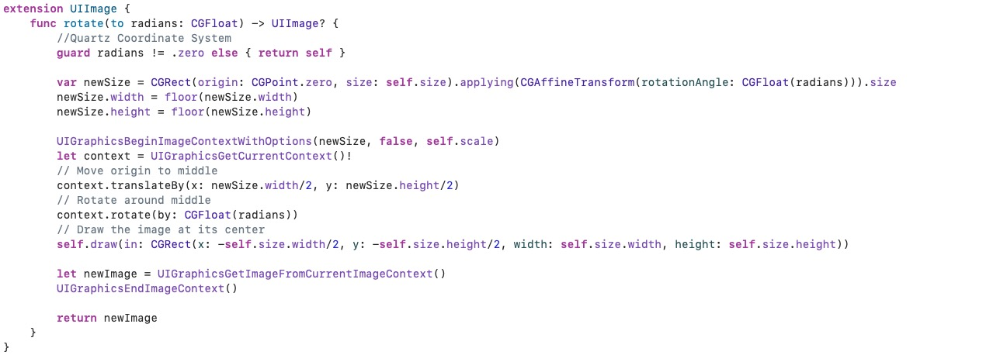
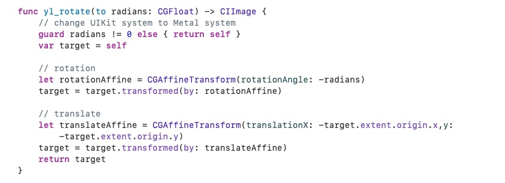

# 仿射变换在MediaKit中的应用


在编辑模块的开发过程中，无论是UIView层涉及到的复杂交互动画，还是用CoreImage、CoreGraphics对图片进行处理，全都围绕着仿射变换这个技术点，因此我将从以下三个方面介绍一下仿射变换在MediaKit中的应用。


* **仿射变换概念及原理**
* **仿射变换在UIKit下的注意事项**
* **仿射变换在CoreImage/CoreGraphics下注意事项**
* **仿射变换在MediaKit中的应用场景**

<br>

## 一、仿射变换概念及原理

计算机图形学中对二维图形的变换，主要包含**平移、翻转、旋转、缩放、错切**五种变换，对应下图所示。


<br>


在数学上，一般将这五种变化统称为仿射变换，仿射变换实际上是一种坐标映射，即把原图形上的每一个点(x,y)按照一定**函数关系**映射到点(x',y')上，最终得到的新图形与原图形相比，依然保持图形的“平直性”（即变换后直线还是直线）和“平行性”（即变换后平行线还是平行线)。为了能够让计算机处理这些几何变换，我们需要将其转换成代数形式，而将**平移、翻转、旋转、缩放、错切**转换成代数表达,分别对应如下：


**平移**:     
    
**x' = x + tx**    
**y' = y + ty**

<br>


**缩放&&翻转**:  
      

**x' = ax**      
**y' = by**

<br>

**旋转**:  
   
**x' = xcosθ - ysinθ**     
**y' = xsinθ + ycosθ**

<br>

**错切**:  
   .  
**x' = x + ay**    
**y' = y + bx**	  

<br>
<br>


**对于上述表达式，可以简化成一个通用表达式**：   
**<center>x' = ax + cy + tx</center>**
**<center>y' = bx + dy + ty</center>**


若ad = 1, bc = 0，txty不为0，则可以描述平移;若ad不为0，bc = 0，txty = 0, 可以描述缩放;若ad不为0，bc不为0, txty=0, 可以描述旋转;以此类推......

因此，只需要通过约束这6个**变化因子**，我们就可以通过代数来描述出一个坐标点在其坐标系下的仿射变化，需要注意的是，除了tx、ty是两个独立的用于描述平移的因子，abcd四个因子共同约束了**翻转、旋转、缩放、错切**，如果一个图形包含了几个变化的叠加，则abcd无法直观的体现其缩放倍数、旋转角度、错切系数，但tx，ty可以直观的描述出其平移的大小。


这6个变化因子，苹果的CoreGraphis框架帮我们封装在了CGAffineTransform结构体中：


<br>

为了让计算机更加高效的存储及计算这些变化，在实际计算过程中，是以一个3X3的矩阵来存放这些变化因子:   


<br>

于是，我们便将图形的几何变换，转换成了计算机能够识别的矩阵代数变化:


<br>

各种变换对应的矩阵:     
<br>


<br>


事实上，**物理屏幕要呈现图像，就是CPU/GPU时刻计算好每一个像素在物理屏幕二维坐标系下所在的位置**。其中仿射变换是计算机图形学中对2D图形变化的基础。需要注意的是，在实际开发中，参考坐标系并不是唯一的，在图形被渲染到物理屏幕之前，它可能会在自身坐标系经历复杂的仿射变换，还要再将所有坐标点再映射到另外一个坐标空间中（如UIKit坐标系和CoreGraphics坐标系），即坐标系之间的映射，又叫坐标系空间转换。 因此，仿射变换可以是图像相对其坐标系，也可以是坐标系相对其图像，还可能是坐标系相对坐标系，这点在实际开发中非常重要。


此外，为了将三维世界投影到二维物理屏幕上，还有**投影(透视)变换**，相机成像、CoreAnimation/OpenGL/Metal中的3D绘图就是基于这个概念。


<br>
<br>

## 二、仿射变换在UIKit下的注意事项

苹果的UIKit框架提供了一套很简便的仿射变换和3D变换API，UIView/CALayer的CGAffineTransform属性可以用来对视图进行二维的仿射变换，CALayer的CATransform3D可以用来对视图进行三维空间的投影变换，通过这些变换，我们可以很轻松的实现一些动画效果。这些API的使用大家都很熟悉，这里不作展开。这里主要是从仿射变换的概念出发，讲讲系统是如何帮我们实现这些动画，并且分析一下通过transform和frame实现的动画有什么区别，以及UIView的transform、bounds、frame几个属性的区别和联系。


### UIView绕任意点旋转

```
        /// 将View顺时针旋转90度
        var transform = CGAffineTransform.identity
        transform = transform.rotated(by: .pi / 4)
        view.transform = transform
```
上述代码会把一个View绕其中心点顺时针旋转45度，仔细观察不难发现，这里和我们前文中所说的旋转变换的预期结果是冲突的。在仿射旋转变换中，图形的旋转锚点是围绕坐标系原点，而不是图形的中心点，UIKit坐标系即我们的布局坐标系，即以左上角为原点，向右为X正轴，向下为Y正轴的平面直角坐标系。View的坐标原点是父视图的左上角(准确的说是父视图的bounds.origin)，所以旋转应该是围绕原点进行的，而上述代码之所以能够绕图形中点进行旋转，实际上是三个矩阵叠加的效果。系统在进行旋转变换之前，会先将视图中心平移到坐标原点，旋转完成后再将视图反向平移回视图中心点，这样就实现了围绕视图中心旋转的操作。虽然我们只设置了一个旋转矩阵，但实际上视图最终的变换矩阵是经过了三个矩阵叠加后的复合矩阵。


通过前后加一个平移矩阵，实现图形绕坐标系中任意一点进行旋转或缩放。绕任意点旋转的复合矩阵为：


其中(m、n)就是任意点的坐标，θ为旋转角度。

UIView的CALayer有一个AncherPoint属性也是用来控制图层的旋转锚点，实际上这个属性影响的就是系统为我们做的两次隐式平移变换的距离。但我个人不建议通过AncherPoint来实现任意点旋转，因为这个锚点只能确定在视图内部，同时修改它还会影响UIView的位置，容易导致布局混乱。我们可以自己实现上述的复合矩阵：

```
    func compoundRotationTransform(ancherPoint: CGPoint, rotation: CGFloat) -> CGAffineTransform {
        var transform = CGAffineTransform.identity
        transform = transform.translatedBy(x: ancherPoint.x, y: ancherPoint.y)
        transform = transform.rotated(by: rotation)
        transform = transform.translatedBy(x: -ancherPoint.x, y: -ancherPoint.y)
        return transform
    }
```

通过这个复合矩阵，就可以很容易的实现UIView绕任意点旋转。

需要注意的是，并不是所有的绘图框架都会细心的帮我们做一些隐式变换，比如CoreImage/CoreGraphics在进行UIImage绘制时，旋转都是默认围绕坐标系原点进行，且不同的坐标系原点位置也可能不同，这里是我在开发过程中很容易出错的地方。一般的，如果图形绘制的结果和预期的不一样，那么大概率是因为缺少一些坐标系之间的映射。


<br>

### UIView的center、bounds、 frame、transform属性

不知道是否有人和我一样，刚接触iOS的时候，对frame和bounds两个属性一直很迷惑，因为改变center、frame、bounds，都会影响View的大小或位置，而一旦再加上transform，这几个属性代表的意义就更加让人迷惑。所以我根据仿射变换的原理来理清这几个属性的几何概念，掌握这些概，对解决一些复杂的界面布局问题有很大帮助。


我们知道，在一个平面坐标系下，要想唯一确定一个矩形，需要知道它的四个顶点坐标。为了减小变量个数，可以用中心点 + 矩形的宽高等价代替。在UIKit坐标系下，即用一个CGPoint + 一个CGSize就可以唯一确定一个矩形，我们把中心点记为center，宽高记为size，center和size。而当我们给这个视图设置了一系列仿射变换，UIKit会把这些变化记录在一个3 * 3的矩阵之内，也就是transform， 这样，通过center、size、transform，就可以在这个UIKit坐标系下唯一绘制出我们想要的图形。

为了能够将图形还原，这三个属性不能互相影响，必须完全独立。即改变transform，是不能对图形的原始位置和原始尺寸产生影响，可以理解成center、size是对原图的描述，transform是对变换过程的描述。

那么变换后的图形该如何描述呢，如果这个图形依然是矩形，我们可以用一个frame来描述它，frame实际上也是一个CGPoint+一个CGSize，不过这个点是矩形左上角坐标。但如果经过变换后的图形不再是矩形，那么我们很难直观的描述出这个图形，只能通过它的center、size、transform去绘制，这时候的frame，描述的是能够容纳这个不规则图形的最小矩形区域。


明白这些几何概念，我们来逐一分析下UIView的这些属性：

<br>


**(get) center:** 获取原始中心点坐标。   
**(set) center:** 设置原始中心点坐标。

<br>

**(get) bounds:** origin：获取子视图的参考坐标系原点。size: 获取原始宽高。   
**(set) bounds:** origin：设置子视图的参考坐标系原点、size: 设置原始宽高。

<br>

**(get) frame:** 获取图形变换前或变换后的矩形区域，origin为矩形左上角坐标，size为矩形宽高。如果变换后的图形不规则，描述能够容纳这个不规则图形的最小矩形区域。   
**(set) frame:** 改变view的原始中心点坐标、改变view的原始宽高。


<br>

**(get) transform:** 获取view的仿射矩阵。   
**(set) transform:** 设置view的仿射矩阵。

<br>


### frame动画和transform动画的区别：

通过对上面几个属性的分析，我们也能够得出以下结论：

1.通过改变frame执行动画，会修改view的原始尺寸和大小，触发子视图的layoutsubview方法。而frame动画是对view本身的，其子视图不会参与动画。对于一些多层级的界面，用frame做动画效果上会有问题。而frame动画还原，也需要我们自己记录变化前的尺寸。

2. transform执行动画，是对每一个像素点进行仿射变换，改变的是渲染方式，而不会改变view本身的size和center属性。即使是多层级界面，子视图也会跟着一起执行动画，而通过CGAffineTransform.identity,可以很容易的复原view。


总结：   
* **transform、center、bounds.size唯一确定一个图形，互不影响。**  
* **frame是一个复合属性，是由transform、center、bounds.size共同计算得到的。set时改变的是原图形的center和size，get的是变换后的图形描述,因此受transform、center、bounds.size影响。**   
* **bounds.origin不影响自身，只影响子视图的参考坐标系。**


<br>
<br>

## 三、仿射变换在图片编辑下的注意事项


MediaKit中使用CoreGraphics/CoreImage来实现图片编辑，CoreGraphics是基于QuartZ的绘图框架。CoreImage是基于Metal的图片处理框架。这两个框架都提供了大量的图片处理API。

MediaKit编辑模块中涉及了很多坐标/坐标系的复杂变换，而很多需求场景网上找不到现成代码，需要自己在草稿纸上计算仿射矩阵，导致废了很多精力。根本原因也在于对仿射变换的掌握不够熟练，我通过MediaKit中基于CoreGraphics和CoreImage的实现的两个图片旋转方法，来介绍一下仿射变换在这两个编辑框架中的应用及注意事项。


### 通过CoreGraphics旋转UIImage对象



UIKit坐标系下的仿射变换很容易实现，但UIImage的这个扩展方法相信大多数人第一次看到都会比较费解。因为它不像UIView那样简单，给view设置好transform矩阵，view就会变成我们期望的样子，方法中的CGContext是什么，为什么是对CGContext进行旋转、偏移，又为什么还需要对这个CGContext设置size等属性，self.draw(in rect: CGRect)的rect又是什么？大家可能都会有这些疑问。这里根据个人理解一一做下解释：


**1. CGContext是什么？**

一个图形想要进行变换，需要先将这个视图放入一个坐标空间中，UIKit在我们创建一个view并且添加到父视图上时，就等同于我们将这个view放入了以父试图bounds.origin为原点，x向左y向下的坐标空间里。而UIImage初始化的时候没有与位置相关的属性，他只有一个Size，因此UIImage对象缺少一个参考系。CoreGraphics是用来绘图的，可以自定义绘制内容，甚至从无到有绘制图形(比如使用贝塞尔曲线绘制图形)，既然要绘制，就需要建坐标系。CGContext就起到了这个作用，网上一般把CGContext称作画布、画板，我更喜欢把它看成一个带有边界的坐标空间。

**2. 为什么CoreGraphics中的仿射变换不像UIKit那样直接对图形进行变换，而是对坐标系变换？**

对一个坐标进行一次仿射变换，和对坐标系进行这个仿射变换的逆变换，观察两个变换结果，可以发现坐标在坐标系中的相对位置是相同的。因此，如果不需要考虑坐标系本身的绝对位置，那旋转坐标和旋转坐标系，最终都可以得到我们想要的图形。而UIKit坐标系，视图所在的坐标空间不是我们自己建立的，而是由它的父试图决定，而最底层的坐标系即UIWindow，它和物理屏幕坐标系是保持一致，我们不应该忽视它的绝对位置，所以在UIKit下，我们对View本身做仿射变换更合理。

CGContext的坐标系由我们自己建立，绘制的结果是输出一个矩形图，对其所在坐标系绝对位置没有要求，因此我们可以通过仿射坐标系来达到和仿射图形一样的结果。


**3. 坐标系变换后，UIImage的draw(in rect: CGRect)是什么意思？**
和UIKit不同，view的仿射结果最终可以不是一个矩形，但UIImage的仿射最终输出的依然还是一个矩形，所以经过一系列仿射变换后，我们需要从结果图形中截取一个矩形，否则最终生成的图片可能会存在空白像素点。


注意事项总结：
* CoreGraphics绘图过程中，仿射变换的对象是坐标系而不是图形。
* CoreGraphics的绘图坐标系是以左下角为原点，x向左y向上。


<br>

### 通过CoreImage旋转CIImage对象



CoreImage的旋转相比于CoreGraphics看起来简单很多，更类似于UIKit的旋转，只需要对CIImage设置旋转和偏移矩阵，就能得到一个新的CIImage图形，CIImage可以直接用于渲染，也可以转成UIImage导出。CoreImage的仿射对象也是图形本身，所以使用起来和UIView很相似，但又不完全相同，主要在于坐标空间不同。

不同于CoreGraphics，每一个CIImage对象，系统都会创建一个与之关联的坐标空间，CIImage的所有变换都在这个坐标空间内：   


这里对上述方法中的两个矩阵做下解释：

**1. 为什么CIImage的旋转角度要取反，而UIView不需要？**

UIView初始化后的默认矩阵因子为，【a=1，d=1,b=0，c=0,tx=0，ty=0】,说明图形没有经过任何仿射变换。而CIImage初始化后会有一个默认矩阵【a=1，d=-1，b=0，c=0，tx=0，ty=h】(具体原因不知，暂时没有找到相关资料，个人猜测是为了记录UIKit和CoreImage坐标系的仿射) ,而因为有这个默认的矩阵在，d又是同时决定旋转、缩放、翻转的因子，d为-1，导致旋转需要取负号。


**1. CIImage旋转完成后为什么要平移动到坐标原点？**

与UIKit不同，CIImage的旋转是围绕左下角原点进行的，当我们旋转完任意度数后，需要将新的图形左下角顶点与坐标原点重合才能完成后续绘制。
简单来说，UIKit的坐标系，是为了确定父、子视图的相对关系，而CoreImage、CoreGraphics的坐标系，是为了绘制仿射图像而建立的。


**上面只是简单的讲解了使用CoreImage和CoreGraphics进行图片旋转的实现，在实际图片编辑中，因为坐标系的不同，旋转、缩放、裁剪、镜像等操作，每一个可能都需要经过几个矩阵叠加才能实现，而裁剪、旋转、缩放、镜像这些编辑操作本身之间又可以互相叠加，导致最终可能是几十个仿射矩阵的叠加，同时矩阵的先后顺序也会影响结果，可能一个矩阵设置错误，得到的结果就会错误，这也是我在开发MediaKit过程中的主要难点之一。**


## 四、仿射变换在MediaKit中的应用场景

1. 编辑模块：编辑指令动画、贴纸手势操作交互动画、裁剪旋转交互动画、画板与图层的布局更新等。

2. 相机模块：对摄像头采集到的图像Buffer进行实时的裁剪、旋转、镜像等操作。

3. 合成压缩模块：图片的合成及导出，视频的合成及导出。


.....
