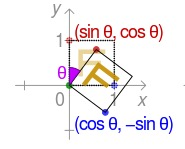
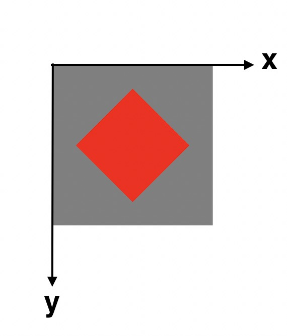

# 仿射变换在MediaKit中的应用

在MediaKit的开发过程中，无论是UIView涉及到的复杂交互动画，还是用CoreImage、CoreGraphics对图片进行处理，都离不开仿射变换这个技术点，其中最令人头疼的两个点是，有些场景要对图形进行复杂的几何变换，仿射矩阵该如何设置的问题，以及有些场景需要通过观察多个仿射矩阵的叠加，来反推出图形的几何变换过程，这需要很强的空间想象力，所以今天我将以下几个方面重点展开介绍一下仿射变换，目的是让大家能够建立起几何仿射转代数矩阵，以及通过观察代数矩阵想象几何仿射的能力。

 

* **应用场景**
* **概念及原理**
* **UIKit下的仿射变换及注意事项**
* **CoreGraphics/CoreImage下的仿射变换及注意事项**
* **经验心得** 

 

## 一、应用场景

1. 编辑模块：编辑指令动画、贴纸手势操作交互动画、裁剪旋转交互动画、画板与图层的布局更新等。

2. 相机模块：对摄像头采集到的图像Buffer进行实时的裁剪、旋转、镜像等操作。

3. 合成压缩模块：图片的合成及导出，视频的合成及导出。

.....
 

## 二、概念及原理

计算机图形学中，一个二维图形的变换主要包含**平移、翻转、旋转、缩放、错切**五种变换，对应下图所示。

 

在数学上一般将这五种变化统称为仿射变换，仿射变换实际上是一种坐标映射，即把原图形上的每一个坐标点(x,y)按照一定**函数关系**映射到点(x',y')上，最终得到的新图形与原图形相比，依然保持图形的“平直性”（即变换后直线还是直线）和“平行性”（即变换后平行线还是平行线)。为了能够让计算机处理计算这些几何变换，我们需要将其几何形式转换成代数形式，而将**平移、翻转、旋转、缩放、错切**转换成代数表达，分别对应如下：

     
    
x' = x + tx    
y' = y + ty   
**平移**

 
 

 
       
x' = ax      
y' = by   
**缩放&&翻转** 

 
 

  
   
x' = xcosθ - ysinθ     
y' = xsinθ + ycosθ   
**旋转**

 
 

  
   .  
x' = x + ay    
y' = y + bx      
**错切**

 
 

**对于上述表达式，可以合并成一个通用表达式**：   
**
x' = ax + cy + tx
**
**
y' = bx + dy + ty
**

观察这个通用表达式，可以发现: 若ad = 1, bc = 0，txty不为0，则可以描述图形的平移; 若ad不为0，bc = 0，txty = 0, 可以描述图形的缩放; 若ad不为0，bc不为0, txty=0, 可以描述图形旋转;以此类推......

因此只需要通过约束这6个**变化因子**，我们就可以通过代数来描述出一个坐标点在其坐标系下的仿射变化，需要注意的是，除了tx、ty是两个独立的用于描述平移的因子，abcd四个因子共同约束了**翻转、旋转、缩放、错切**，如果一个图形包含了几个变化的叠加，则abcd无法直观的体现其缩放倍数、旋转角度、错切系数，而tx，ty可以直观的描述出其平移的大小。

这6个变化因子，苹果的CoreGraphis框架帮我们封装在了CGAffineTransform结构体中： 

	
	 

 
 

为了让计算机更加高效的存储及计算这些变化，在实际计算过程中，是以一个3X3的矩阵来存放这些变化因子:   

	

 

于是，我们便将图形的几何变换，转换成了计算机能够识别的矩阵代数变化:

	

 

各种变换对应的矩阵:     
 

	

 

仿射变换是计算机图形学中对2D图形进行变化的基础，此外，还有能将三维世界投影到二维物理屏幕上的**透视投影变换**，相机成像、CoreAnimation/OpenGL/Metal中的3D绘图就是基于这个概念。

事实上，**物理屏幕要呈现任意图像，需要CPU/GPU时刻计算好每一个像素在物理屏幕二维坐标系下所在的位置**。需要注意的是，在实际开发中，图形的参考坐标系并不是固定的，在图形最终被映射到物理屏幕渲染之前，它可能会在自身坐标系经历复杂的变换，也会将所有坐标点映射到另外一个坐标空间中，即坐标系之间的映射，又叫坐标系空间转换。 所以**仿射变换的对象可以是图像，也可以是坐标系**。

 
 

## 三、UIKit下的仿射变换及注意事项

苹果的UIKit框架提供了一套很简便的对UIView的仿射变换和3D变换API，UIView/CALayer的CGAffineTransform属性可以用来对视图进行二维的仿射变换，CALayer的CATransform3D可以用来对视图进行三维空间的投影变换，通过这些变换，我们可以很轻松的实现一些动画效果。这些API的使用大家都很熟悉，这里不再展开。我主要是从仿射变换的概念出发，讲讲系统是如何帮我们实现这些动画，并且分析一下通过transform和frame实现的动画有什么区别，以及UIView的transform、bounds、frame几个属性的区别。

### UIView绕任意点旋转矩阵

	
	

上述代码把红色视图绕自身中心点顺时针旋转了45度，这和前文中所说的旋转变换的预期结果是冲突的。UIKit坐标系即我们的布局坐标系，红色视图是在以灰色视图左上角为原点，向右为X正轴，向下为Y正轴的坐标系中布局，红色视图应该是围绕灰色视图左上角进行旋转、缩放的，而上述代码之所以能够绕图形中点进行旋转，实际上是三个矩阵叠加的效果。在进行旋转变换之前，会先将红色视图的中心平移到坐标原点，旋转完成后再将视图反向平移回红色视图中心点，这样就实现了围绕自身中心旋转的变换操作，**而前后两次平移矩阵是系统帮我们隐式叠加的。**

通过前后加一个平移矩阵，实现图形绕坐标系中任意一点进行旋转或缩放。绕任意点旋转的复合矩阵为：
 

	

 

其中(m、n)就是任意点的坐标，θ为旋转角度。

UIView的CALayer有一个AncherPoint属性可以用来控制图层的旋转锚点，实际上这个属性影响的就是系统为我们做的两次隐式平移变换的距离。但我个人不建议通过AncherPoint来实现任意点旋转，因为这个锚点只能限定在视图内部，同时修改它也会影响UIView的位置，容易导致布局混乱。我们可以自己实现上述的复合矩阵：

 

	

 

通过这个复合矩阵，可以很容易的实现UIView绕任意点旋转，而不需要通过修改AncherPoint。

需要注意的是，并不是所有的绘图形框架都会帮我们做一些隐式变换，比如CoreImage/CoreGraphics在进行UIImage旋转时是围绕坐标系原点，而不同的框架坐标系也有所不同，这里是我在开发过程中很容易出错的地方。一般的，如果图形最终绘制的结果和预期的不一样，那么大概率是因为遗漏了一些必要的仿射矩阵。

 

### 理解UIView的center、bounds、 frame、transform属性

刚接触iOS的时候，对frame和bounds两个属性一直很迷惑，因为改变center、frame、bounds都会影响View的大小或位置，而一旦再加上transform，这几个属性代表的意义更容易让人费解。所以我根据仿射变换的原理来理清这几个属性的几何概念，掌握这些概，对解决一些复杂的界面布局或者动画问题有很大帮助。

在一个平面坐标系下，要想唯一确定一个矩形，需要知道它的四个顶点坐标。为了减小变量个数，可以用任意一点坐标 + 矩形的宽高等价代替。在UIKit坐标系下，即用一个CGPoint + 一个CGSize就可以唯一确定一个矩形，我们把中心点记为center，宽高记为bounds.size。通过center和bounds.size确定一个未经变换的矩形。而当我们给这个视图设置了仿射变换，UIKit会把这些变化记录在transform中， 这样，通过center、 bounds.size、transform，就可以在这个UIKit坐标系下绘制出我们想要的图形。

为了能够将图形还原，**这三个属性不能互相影响**，完全独立。可以理解成center、bounds.size是对原始图形的记录，transform是对图形变换过程的记录。

而变换前后的图形我们还可以用frame来描述它，frame实际上也是一个CGPoint+一个CGSize，不过这个Point是矩形左上角坐标。如果经过变换后的图形不再是矩形，那么frame就很难直观的描述出出这个图形，这时候的frame，描述的是能够容纳这个不规则图形的最小矩形区域。因此，frame的size和bounds的size，在图形未变化前是一致的，变化后则可能不一样。

 

>**center (get):** 获取原始矩形中心点坐标。   
>**center (set):** 设置原始矩形中心点坐标。

 

>**bounds (get):** origin：获取子视图的参考坐标系原点。size: 获取原始矩形宽高。   
>**bounds (set):** origin：设置子视图的参考坐标系原点。size: 设置原始矩形宽高。

 

>**frame (get):** origin: 获取后矩形左上角坐标。      size：获取变换后的矩形宽高。**如果变换后的图形不规则，描述能够容纳这个不规则图形的最小矩形区域。**   
>**frame (set):** origin: 设置原始矩形中心点坐标。    size: 设置原始矩形宽高。

 

>**(get) transform:** 获取仿射矩阵。   
>**(set) transform:** 设置仿射矩阵。

结论：   
* **transform、center、bounds.size唯一确定一个图形，互不影响。**  
* **frame是一个复合属性，是由transform、center、bounds.size共同计算得到的。set时改变的是原图形的center和size，get的是变换后的图形描述，因此受transform、center、bounds.size影响。**   
* **bounds.origin不影响自身，只影响子视图的参考坐标系原点，即影响子视图与自身的相对位置。**

 

### frame动画和transform动画的区别：

通过对上面几个属性的分析，我们也能够得出以下结论：

1. 通过改变frame执行动画，会修改view的原始center和size，并触发子视图的layoutsubview方法。frame动画只对自身生效，子视图不会参与动画。对于一些多层级的界面，用frame做动画效果往往不好，还原也需要我们自己记录变化前的位置和大小。

2. transform执行动画，是对每一个像素点进行仿射变换，改变的是渲染映射关系，不会改变view本身的size和center属性。即使是多层级界面，子视图也会跟着一起执行动画，而通过CGAffineTransform.identity，也可以很容易的复原view。

 
 

## 四、CoreGraphics/CoreImage下的仿射变换及注意事项

MediaKit中使用CoreGraphics/CoreImage来实现图片编辑，CoreGraphics是基于QuartZ的绘图框架。CoreImage是基于Metal的图片处理框架。这两个框架都提供了丰富的图片处理API。

MediaKit的编辑模块中涉及了很多坐标/坐标系的复杂变换，而很多需求场景网上找不到现成代码，需要自己在草稿纸上计算仿射矩阵，导致废了不少精力。根本原因也在于对仿射变换的掌握不够熟练，我通过MediaKit中基于CoreGraphics和CoreImage的实现的两个图片旋转方法，通过其仿射矩阵反向推演其几何仿射的逆向过程，来介绍一下仿射变换在这两个编辑框架中的注意事项。

### 通过CoreGraphics旋转UIImage对象

	
	 

 

UIView的仿射变换很容易实现和理解，但UIImage的这个旋转方法相信大多数人第一次看到都会比较费解。因为它不像view那样置好transform矩阵，view就会变成我们期望的样子。方法中的CGContext是什么？为什么是对CGContext进行旋转、偏移？CGContext的size属性是什么？self.draw(in rect: CGRect)中的rect又是什么？

**1. CGContext是什么？**

一个图形想要进行变换，需要先将这个图形放入一个坐标空间中，UIKit在我们创建一个view并且添加到父视图上时，就等同于我们将这个view放入了以父试图bounds.origin为原点，x向左y向下的坐标空间里。而UIImage初始化的时候没有与位置相关的属性，他只有一个Size，因此UIImage对象缺少一个布局参考系。CoreGraphics框架是用来绘图的，可以自定义绘制内容，甚至从无到有绘制图形(比如使用贝塞尔曲线绘制图形)，既然要绘制，就需要建立坐标系。CGContext就起到了这个作用，网上一般把CGContext称作画布、画板，我更喜欢把它想象成一个带有边界的坐标空间。从某种角度来说，CGContext相对于UIImage，和UIView想对其子视图一样，是其容器，而容器内的图形将在这个容器内进行布局及仿射。

**2. CoreGraphics中的仿射变换为什么不像UIKit那样直接对图形进行变换，而是对CGContext进行坐标系变换？**

固定坐标系，对坐标点进行一个仿射变换，和固定坐标点，对坐标系进行这个仿射变换的逆变换，观察两个变换结果，可以发现坐标点与坐标系的相对位置是相同的。因此，如果不需要考虑坐标系本身的绝对位置，那旋转坐标和旋转坐标系，最终都可以得到我们想要的图形。而UIView所在的坐标空间不是我们自己建立的，由它的父视图决定，而最底层的坐标系即UIWindow，它和物理屏幕坐标系保持一致，我们不应该忽视它的绝对位置，所以在UIKit下，我们对View本身做仿射变换更合理。

CGContext的坐标系只作为图形的仿射空间，我们不需要关心坐标系本身的绝对位置。所以我们可以通过仿射坐标系来达到和仿射图形一样的结果。而绘制图形除了需要进行仿射变换，还有其他绘制参数要设置，这些参数设置给CGContext更合理，自然仿射矩阵设置给CGContext也更方便。

**3. 代码中的CGContext坐标系为什么和UIKit一样都是以左上角为原点，而不是和CoreGraphics保持一致？**

>The environment also uses the default coordinate system for UIKit views, where the origin is in the upper-left corner and the positive axes extend down and to the right of the origin. The supplied scale factor is also applied to the coordinate system and resulting images. The drawing environment is pushed onto the graphics context stack immediately.

这是苹果官网上的解释，事实上，CGContext有多种创建方式，UIGraphicsBeginImageContextWithOptions、UIGraphicsGetCurrentContext、CGContext.init(...)等都可以获取一个上下文，而通过不同API获取到的上下文，其坐标系原点有所不同。有的是UIKit坐标系，有的是CoreGraphics坐标系，事实上CGContext的初始坐标系都是CoreGraphics坐标系，只是苹果在某些API中提前将CGContext从CoreGraphics变换到了UIKit坐标系。这里有个小技巧，你可以通过打印获取到的CGContext.ctm，来判断当前上下文是否经过系统的坐标变换。感兴趣的可以自己尝试一下。

**4. 坐标系变换后，UIImage的draw(in rect: CGRect)是什么意思？**
将CGContext当成父视图建立坐标系，Size作为这个坐标空间的边界，左上角为坐标原点。draw(in: rect: CGRect)的rect即**这个UIImage被放入到该坐标系下的初始大小和位置，可以等价于view未经过变换前的frame。**需要注意的是，随然draw(in rect: CGRect)是在CGContext仿射之后，但真正的逻辑顺序是先确定了UIImage的初始rect，再将这个rect放入坐标空间中，再进行坐标空间的仿射变换，最后获取新图。

CoreGraphics注意事项总结：
* CoreGraphics绘图过程中，仿射变换的对象是坐标系而不是坐标点。
* CGContext的坐标系不一定是CoreGraphics坐标系，系统有可能帮我们提前做过坐标系变换，如UIGraphicsBeginImageContextWithOptions得到的上下文就是UIKit坐标系。其默认矩阵的d值为-1，ty为height。
* CGContext可以想象成是画板、画布、坐标空间，相对于其将要绘制的图形，可以想象成UIView的父视图与子视图关系。不同之处是UIView中，子视图相对于父视图进行仿射，CoreGraphics中，CGContext相对于绘制图形进行仿射。

 

### 通过CoreImage旋转CIImage对象

	
	 

CoreImage的旋转相比于CoreGraphics看起来简单很多，更接近于UIKit，只需要对CIImage设置旋转和偏移矩阵，就能得到一个新的CIImage图形，CIImage可以直接用于渲染，也可以转成UIImage。CoreImage的仿射对象也是图形本身，所以使用起来和UIView很相似，仿射矩阵的设置也很容易，但是和UIView的仿射又有些不同。

不同于CoreGraphics，**每一个CIImage对象，系统都会自动创建一个与之关联的坐标空间**，而不需要我们自己创建Context，每一个CIImage的所有变换都会在这个坐标空间内：   

	
	 

这里对上述方法中的两个矩阵做下解释：

**1. 为什么CIImage的旋转角度要取反，而UIView不需要？**

UIView初始化后的默认矩阵因子为，【a=1，d=1,b=0，c=0,tx=0，ty=0】,说明图形没有经过任何仿射变换。而CIImage初始化后会有一个默认矩阵【a=1，d=-1，b=0，c=0，tx=0，ty=h】，说明该图像所在坐标系中已经经过坐标系转换,而因为有这个默认的矩阵在，d又是同时决定旋转、缩放、翻转的因子，d为-1，导致旋转需要取负号。

**1. CIImage旋转完成后为什么要平移动到坐标原点？**

与UIKit不同，CIImage的旋转是围绕左下角原点进行的，当我们旋转完任意度数后，需要将新的图形左下角顶点与坐标原点重合才能完成后续绘制。
简单来说，UIKit的坐标系，是为了确定父、子视图的相对关系，而CoreImage、CoreGraphics的坐标系，是为了绘制仿射图像而建立的。

CoreImage注意事项总结：
* CoreImage的仿射矩阵设置与UIView类似，是对图形本身进行仿射。
* CoreImage的坐标系是以左下角为原点。
* UIView对象的仿射矩阵可以累加，CIImage对象则是每次仿射后都会生成一个新的CIImage，各自有自己的独立空间，这点在变换叠加时需要注意。

## 五.经验心得

**上面简单的讲解了使用CoreImage和CoreGraphics进行图片旋转的实现，在实际图片编辑中，因为坐标系的不同，旋转、缩放、裁剪、镜像等操作，每一个可能都需要经过几个矩阵叠加才能实现，而裁剪、旋转、缩放、镜像这些编辑操作本身之间又可以互相叠加，导致最终效果可能是几十个仿射矩阵的叠加，而矩阵的设置顺序不同，结果有可能正确，也可能错误，越复杂的场景，就需要越强的空间想象能力。 这也是我在开发MediaKit过程中的主要难点之一。这边有几个自己开发中的小技巧分享：**

1. 对于一些不熟悉的坐标系统，我们可以单独实现translate、rotate、scale，观察每种仿射输出图形，以此来确定图像的坐标系，面对后续复杂的矩阵时脑海中容易构建几何仿射画面。
2. 如果坐标系和我们常用的UIKit坐标系不同，而系统又没帮我们做坐标系映射，我们可以自己将坐标系转换到UIKit，再在熟悉的坐标系统下编辑图形。
3. 对于一些系统做了坐标映射的坐标系，需要注意初始矩阵的值，否则后续在设置诸如旋转矩阵时，容易出现方向错误。

